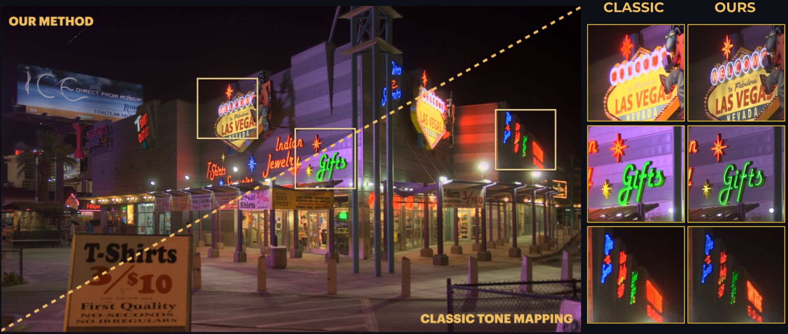
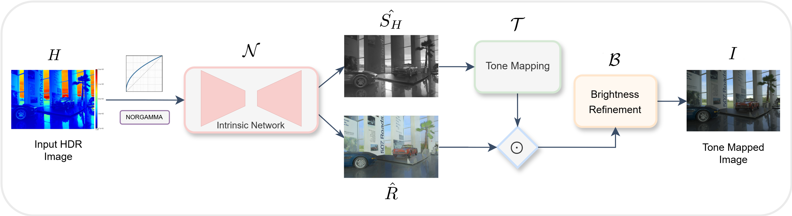

# A Color Preserving Tone Mapping Framework in the Intrinsic Domain

[](https://iopscience.iop.org/article/10.1088/1742-6596/3128/1/012008)


**Authors:** S. Melcarne¹, P. Cyriac², J.L. Dugelay¹, A. Artusi³, F. Banterle⁴

¹ *Eurecom Research Center, Sophia Antipolis, France* ² *Huawei Nice Research Center, Mougins, France* ³ *DeepCamera MRG, RISE Ltd, Nicosia, Cyprus* ⁴ *Visual Computing Lab, ISTI-CNR, Pisa, Italy*

<p align="center">
  
</p>

---

## Publication
This paper has been accepted for publication at the **6th London Imaging Meeting (LIM 2025)** and appears in the **IOP Journal of Physics: Conference Series**.

---

## Abstract
Tone mapping is an essential step in an acquisition or a rendering pipeline to map high dynamic range (HDR) content to a reference display range. The simplest tone mapping approach is to apply a function to the luminance channel of an HDR image and then to propagate the change to the red, green, and blue channels. However, this often causes color distortions since luminance and chrominance channels are interdependent. We propose a novel tone mapping approach that preliminarily decomposes the image into intrinsic components (Reflectance and Shading) and leverages them to perform the actual operation. This strategy effectively mitigates color distortions, eliminating the need for post-processing color correction required by many state-of-the-art methods, and it also assists tone mapping operators (TMOs), improving the overall image quality.

---

## The Framework

<p align="center">
  
</p>


Our method formulates tone mapping in the **intrinsic domain**. Instead of processing the luminance channel directly, we decompose the image into:
1.  **Reflectance ($R$):** Invariant to illumination changes (spectral properties/colors).
2.  **Shading ($S$):** Accounts for illumination effects and high dynamic range.

The pipeline consists of the following steps:
1.  **Encoding:** Input HDR is encoded using **NORGAMMA** (Normalization + Gamma correction) to preserve details.
2.  **Decomposition:** An Intrinsic Image Decomposition (IID) network separates the image into $R$ and $S$.
3.  **Tone Mapping:** The TMO is applied **only to the Shading component** ($S$), leaving the Reflectance ($R$) untouched to preserve original colors.
4.  **Recombination & Refinement:** The components are recombined, and a brightness refinement step normalizes the output.

---

## Repository Structure
* `main.pdf`: Contains the camera-ready version of the paper.
* `additional.pdf`: Additional qualitative comparisons and details on the psychophysical experiment.

---

## Citation

If you find this work useful for your research, please cite our paper:

```bibtex
@article{Melcarne_2025,
doi = {10.1088/1742-6596/3128/1/012008},
url = {https://doi.org/10.1088/1742-6596/3128/1/012008},
year = {2025},
month = {oct},
publisher = {IOP Publishing},
volume = {3128},
number = {1},
pages = {012008},
author = {Melcarne, S and Cyriac, P and Dugelay, J L and Artusi, A and Banterle, F},
title = {A Color Preserving Tone Mapping Framework in the Intrinsic Domain},
journal = {Journal of Physics: Conference Series},
abstract = {Tone mapping is an essential step in an acquisition or a rendering pipeline to map high dynamic range (HDR) content to a reference display range. The simplest tone mapping approach is to apply a function to the luminance channel of an HDR image and then to propagate the change to the red, green, and blue channels. However, this often causes color distortions since luminance and chrominance channels are interdependent, and modifying one affects the other. We propose a novel tone mapping approach that preliminarily decomposes the image into intrinsic components and leverages them to perform the actual operation. This strategy effectively mitigates color distortions, eliminating the need for post-processing color correction required by many state-of-the-art methods, and it also assists tone mapping operators (TMOs), improving the overall image quality. Our method was validated through quantitative metrics and a psychophysical experiment, both demonstrating its effectiveness.}
}

